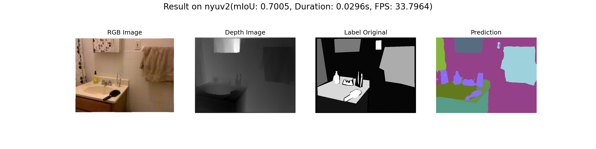

# Efficient Indoor Scene Segmentation Network(EISSegNet)

This is my master's thesis named Efficient Indoor Scene Segmentation Network(EISSegNet), which is a semantic segmentation model for RGB-D images. The proposed model uses a CNN-based encoder-decoder architecture. Compared with the model based on Transformer architecture, the proposed model takes up less memory and has faster inference speed.

<p align="lift">
  <a href="https://opensource.org/licenses/MIT"></a>
</a>
</p>



## Setup

1. Clone repository:

```bash
git clone https://github.com/lizhunan/dissertation-msc.git

cd your_path/dissertation-msc
```

2. Set up anaconda environment including all dependencies:

```bash
# create conda environment from YAML file
conda env create -f requirements.yaml
# activate environment
conda activate eissegnet
```

3. Data preparetion

The EISSegNet is trained on [NYUv2](https://cs.nyu.edu/~silberman/datasets/nyu_depth_v2.html) and [SUNRGB-D](https://rgbd.cs.princeton.edu/). The Encoder were pretrained on ConvNeXt.

The folder [`src/datasets`](src/datasets) contains the code about the preparetion of dataset including downloding and preprocessing. Also, `download_data.py` is used to download the datasets, just run this file to download the dataset to the default directory([`./datasets`](./datasets)). With the following command:

  - NYUv2: `python3 download_data.py  --nyuv2-output-path datasets/nyuv2 --download True`
  - SUNRGB-D: `python3 download_data.py  --rgbd-output-path datasets/sunrgbd --download True`

4. Pretrained model

I provide the weights for my model:

  | Dataset | Model | URL |
   |--|--|--|
   | NYUv2| EISSegNet | [Download](https://drive.google.com/file/d/1OZBNWF0eNuXoqxMgA4lMYLKq00vxCx--/view?usp=drive_link) |
   | SUNRGB-D | EISSegNet | [Download](https://drive.google.com/file/d/1JiZ-iIvCo_whEnWVAPIvNwRnzuFI_OM-/view?usp=drive_link) |

based on nyuv2: https://drive.google.com/file/d/1OZBNWF0eNuXoqxMgA4lMYLKq00vxCx--/view?usp=drive_link

based on sunrgb-d: https://drive.google.com/file/d/1JiZ-iIvCo_whEnWVAPIvNwRnzuFI_OM-/view?usp=drive_link


## Training

Using `train.py` to train model. See the [`src/args.py`](src/args.py) for default parameters. The model file after training is stored in `trained_models`

Example:

- Traning model on NYUv2:
  ```bash
  python3 train.py \
    --dataset_dir ~/dissertation-msc/datasets/nyuv2 \
    --dataset nyuv2 
    --fusion_module ECA \
    --context_module 1 \
    --rgb_encoder convnext_b \
    --depth_encoder convnext_b
  ```

- Traning model on SUNRGB-D:
  ```bash
  python3 train.py \
    --dataset_dir ~/dissertation-msc/datasets/sunrgbd \
    --dataset sunrgbd
  ```

## Evaluation and Inference

To reproduce the mIoUs in my paper, use `inference.py`.
Also, this file could be used for inferece on each RGB image and depth image.

Example:

- Evaluating model on NYUv2:

  ```bash
  python3 inference.py --ckpt_path ~/dissertation-msc/trained_models/ckp_ECA_convnext_b_nyuv2_250.pth \
                        --dataset_dir ~/dissertation-msc/datasets/nyuv2 \
                        --dataset nyuv2 \
                        --num_samples 87 \
                        --context_module 1 \
                        --rgb_encoder convnext_b --depth_encoder convnext_b
  ```

- Evaluating model on SUNRGB-D:

  ```bash
  python3 inference.py --ckpt_path ~/dissertation-msc/trained_models/ckp_sunrgbd_bst_200.pth \
                        --dataset_dir ~/dissertation-msc/datasets/sunrgbd \
                        --dataset sunrgbd \
                        --num_samples 3 \
                        --context_module 1 \
                        --rgb_encoder convnext_b --depth_encoder convnext_b
  ```

After running it, you might get:


## License and Citations

The source code is published under MIT license, see [license file](LICENSE) for details. 

